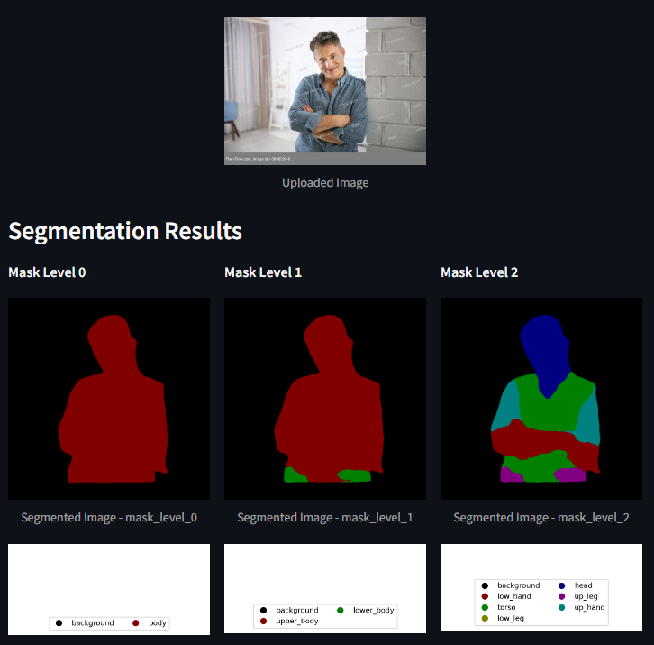

# Human Body Segmentation Project

This project implements a hierarchical semantic segmentation pipeline using a custom deep learning model (`HierarchicalDeepLabV3`). The project includes scripts for training the model, evaluating its performance, and a Streamlit application for visualizing segmentation results.

## Table of Contents
- [Overview](#overview)
- [Installation](#installation)
- [Usage](#usage)
  - [Training](#training)
  - [Evaluation](#evaluation)
  - [Interactive Visualization](#interactive-visualization)
- [Project Structure](#project-structure)
- [Dataset Exploration](#dataset-exploration)
- [Human Body Class Hierarchy](#human-body-class-hierarchy)
- [Future Improvements](#future-improvements)

## Overview

This project aims to develop a hierarchical segmentation model that can identify multiple levels of semantic categories from an image. It uses a modified version of the DeepLabV3 architecture to perform segmentation at three different hierarchical levels. The project provides:
- **Training Script**: To train the model on your dataset.
- **Evaluation Script**: To evaluate the model's performance on a validation set.
- **Interactive App**: A Streamlit-based app to visualize segmentation results.

## Installation

Clone the repository and install the required dependencies:

```bash
git clone https://github.com/olegblokhin11/HumanBodySegmentation.git
cd human-body-segmentation
pip install -r requirements.txt
```

### Install Dependencies
The project requires specific versions of packages listed in the requirements.txt file. Install these dependencies using:

```bash
pip install -r requirements.txt
```

## Usage
### Training
To train the segmentation model, use the `train.py` script. Make sure to set up the appropriate configuration file (`.yml`) before starting the training.

```bash
python train.py
```

**Training Configuration:**
- **Backbone**: Choose the backbone model for the architecture (e.g., ResNet50).
- **Learning Rate**: Specify the learning rate and scheduler in the `.yml` config file.
- **Epochs**: Adjust the number of epochs for training.
- **Batch Size**: Customize the batch size as needed.
- **And More**: Other parameters, such as momentum, weight decay, image augmentation settings, can also be adjusted in the configuration file.

### Evaluation
Evaluate the trained model using the `evaluate.py` script. This will load weights from a checkpoint and run the model on the validation dataset, providing metrics such as Pixel Accuracy, Class Accuracy, Mean IoU.
```bash
python evaluate.py
```

**Output Metrics:** The evaluation script displays metrics for each hierarchical level, such as:
- **Pixel Accuracy**: Measures the percentage of correctly classified pixels.
- **Class Pixel Accuracy**: Calculates the average accuracy per class, **excluding the background class** to focus on segmentation performance for non-background classes.
- **Mean IoU**: Intersection over Union averaged across all classes, **excluding the background class** for a focused evaluation on meaningful regions.

**Current Best Model Metrics:** The following metrics were achieved by the current best model on the validation dataset:
| Level | Pixel Accuracy | Class Pixel Accuracy | Mean IoU |
| :---      |    :---:   |         :---:        |   :---:  |
| Level 0   | 0.964      | 0.935                | 0.868    |
| Level 1   | 0.956      | 0.829                | 0.732    |
| Level 2   | 0.929      | 0.721                | 0.593    |

You can download the best model checkpoint from [Google Drive](https://drive.google.com/file/d/1Bo2IQ5gkCfM9fzLZFOaNjoZlD6nPuX6u/view?usp=sharing) and use it for further evaluation or inference. This model was trained on a Windows system with an NVIDIA RTX 4070 Ti GPU, providing optimal training performance.

## Interactive Visualization
To run the web app and visualize segmentation results, use the `app.py` script. This allows users to upload images and see segmented outputs for each hierarchical level.
```bash
streamlit run app.py
```
To specify a custom port (e.g., 8501), use the `--server.port` option:
```bash
streamlit run app.py --server.port 8501
```
**Accessing the App in a Browser**: After running the command, open your browser and navigate to:
```bash
http://localhost:8501
```

**Example of Web App Segmentation Output:** Below is an example of the web app in action, showing the original image and the corresponding segmentation results at different hierarchical levels.



**Features:**
- Upload an image and get segmented outputs for different levels.
- View color-coded segmentation maps with a legend.
- Compare results easily across different hierarchical levels.

## Project Structure
```bash
segmentation-project/
│
├── configs/                     # Configuration files for training/evaluation
│   └── baseline_heavy.yml
│
├── models/
│   └── hierarchical_deeplabv3.py  # Model architecture
│
├── utils/
|   ├── custom_transforms.py     # Custom transforms function
│   ├── data_utils.py            # Data preprocessing and utilities
│   ├── dataset.py               # Dataset initialization
│   ├── lr_scheduler.py          # Learning rate scheduler
│   ├── metrics.py               # Evaluation metrics
│   ├── saver.py                 # Model checkpointing
│   └── tensorboard_summary.py   # Tensorboard utilities
│
├── train.py                     # Script for training the model
├── evaluate.py                  # Script for evaluating the model
├── app.py                       # Streamlit app for visualizing segmentation
├── requirements.txt             # List of project dependencies
└── README.md                    # Project README
```
## Dataset Exploration

The dataset for this project consists of training and validation splits, with the following sizes:
- **Training Set**: 2,826 images
- **Validation Set**: 707 images

## Human Body Class Hierarchy
The model segments the human body at different levels of detail using a hierarchical structure. Below is the hierarchy used:
- Level 0 (General):
  - (0) Background
  - (1) Body
- Level 1 (Upper/Lower Body):
  - (0) Background
  - (1) Upper Body
  - (2) Lower Body
- Level 2 (Detailed Parts):
  - (0) Background
  - (1) Low Hand
  - (2) Torso
  - (3) Low Leg
  - (4) Head
  - (5) Up Leg
  - (6) Up Hand

## Future Improvements
- **Alternative Architectures:** Exploring and experimentig with additional architectures.
- **Different Loss function:** Try Focal Loss, research for different approaches to use information of class hierarchy.
- **Advanced Augmentation:** In addition to random crop and scale, color jittering, random rotation try some different techniques like elastic deformations, random occlusion.
- **Post-Processing:** Research for better post-processing techniques, which could refine segmentation boundaries and improve metrics.
