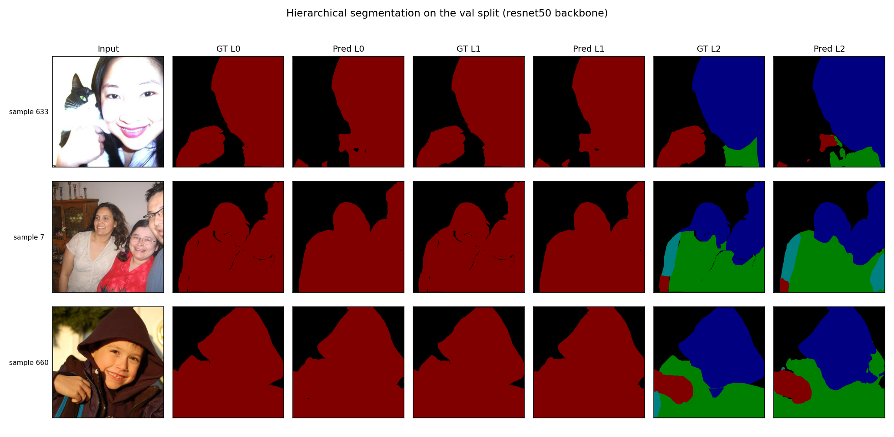
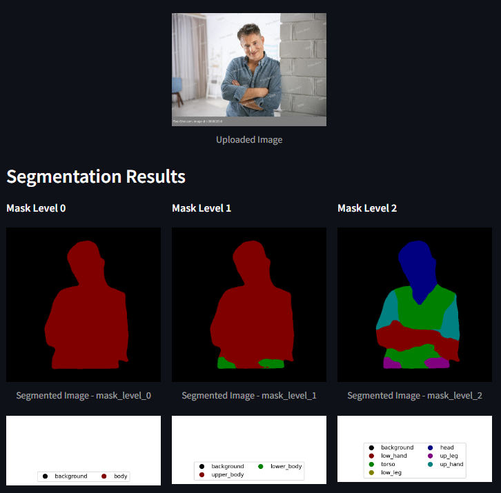

# Hierarchical Human Body Segmentation

[](https://github.com/olegblokhin11/HumanBodySegmentation/actions/workflows/ci.yml)
[](LICENSE)
[](https://www.python.org/downloads/)
[](https://pytorch.org/)

Semantic segmentation of the human body at **three levels of a class hierarchy** with a single
shared backbone. A modified DeepLabV3 predicts a coarse `background / body` split, a
mid-level `upper body / lower body` split, and a fine-grained split into six body parts — all
from one forward pass.

Trained on the prepared Pascal-Part split. The best checkpoint reaches **mIoU 0.868 / 0.732 /
0.593** for the three levels, reproduced end-to-end by the commands in
[Reproducing the results](#reproducing-the-results).



*Input, ground truth (`GT`) and prediction (`Pred`) at levels 0, 1 and 2 on validation samples.
Samples are picked so the person actually fills the frame — see
[Qualitative results](#qualitative-results).*

## Table of Contents

- [Overview](#overview)
- [Results](#results)
  - [Per-level metrics](#per-level-metrics)
  - [Per-class IoU](#per-class-iou)
  - [Qualitative results](#qualitative-results)
- [Quickstart](#quickstart)
  - [1. Install](#1-install)
  - [2. Get the data](#2-get-the-data)
  - [3. Get the checkpoint](#3-get-the-checkpoint)
- [Reproducing the results](#reproducing-the-results)
- [Interactive demo](#interactive-demo)
- [Method](#method)
  - [Class hierarchy](#class-hierarchy)
  - [Architecture](#architecture)
  - [Loss and metrics](#loss-and-metrics)
- [Training](#training)
- [Project structure](#project-structure)
- [Design decisions and observations](#design-decisions-and-observations)
- [Future improvements](#future-improvements)
- [License](#license)

## Overview

The task is hierarchical semantic segmentation on Pascal-Part: a single model must produce
segmentations at several levels of granularity, and the mean IoU is reported **per level with
the background class excluded**.

The repository contains:

- **`models/hierarchical_deeplabv3.py`** — DeepLabV3 with a shared backbone and three
  independent classification heads, one per hierarchy level.
- **`train.py`** — training loop with a configurable LR scheduler (poly / step / cosine /
  cyclic + warmup), TensorBoard logging and checkpoint management.
- **`evaluate.py`** — evaluation that reports pixel accuracy, class accuracy, mIoU per level
  and IoU per individual class.
- **`app.py`** — a Streamlit app for uploading an image and inspecting all three levels.
- **`scripts/visualize_predictions.py`** — renders the qualitative grid used in this README.

## Results

### Per-level metrics

Metrics on the 707-image validation split, background excluded from class accuracy and mIoU:

| Level | Classes scored | Pixel Accuracy | Class Pixel Accuracy | Mean IoU |
| :---- | :------------- | :------------: | :------------------: | :------: |
| 0     | `body`                                       | 0.964 | 0.935 | **0.868** |
| 1     | `upper_body`, `lower_body`                   | 0.956 | 0.829 | **0.732** |
| 2     | `low_hand`, `torso`, `low_leg`, `head`, `up_leg`, `up_hand` | 0.929 | 0.721 | **0.593** |

Average mIoU across the three levels: **0.731** (average validation loss 0.138).

The metric definition follows the task: pixel accuracy counts all pixels, while class pixel
accuracy and mIoU skip the background class so that they measure the body parts rather than the
background dominating the frame.

### Per-class IoU

`evaluate.py` also prints the IoU of every individual class, which is what actually explains the
drop between levels:

| Level | Class | IoU |
| :---- | :---- | :-: |
| 1 | `upper_body` | 0.862 |
| 1 | `lower_body` | 0.602 |
| 2 | `head`       | 0.872 |
| 2 | `torso`      | 0.684 |
| 2 | `low_hand`   | 0.536 |
| 2 | `up_hand`    | 0.525 |
| 2 | `up_leg`     | 0.481 |
| 2 | `low_leg`    | 0.464 |

Three things stand out:

1. **Limbs are the bottleneck.** The four hand/leg classes all sit between 0.46 and 0.54, while
   `head` and `torso` are above 0.68. Limbs are thin, articulated and frequently occluded, and
   their IoU is dominated by boundary error — a handful of pixels of misalignment is a large
   relative error for a narrow region.
2. **The lower body trails the upper body by a wide margin** (0.602 vs 0.862), consistently with
   the leg classes being the weakest at level 2.
3. **Level 0 is strong** (0.868) because the foreground/background boundary is a much easier
   problem than separating parts inside the silhouette.

### Qualitative results

The grid at the top of this README is generated by `scripts/visualize_predictions.py`. A detail
worth noting: a uniformly random validation sample is a poor demo, because most crops are
**93–99 % background** — the model is 96–99 % pixel-accurate there, but there is almost nothing
to look at. The script therefore ranks samples by the fraction of non-background pixels in the
ground-truth mask and picks from a target band, so the figure shows the parts actually being
segmented.

## Quickstart

### 1. Install

```bash
git clone https://github.com/olegblokhin11/HumanBodySegmentation.git
cd HumanBodySegmentation

python -m venv .venv
source .venv/bin/activate        # Windows: .venv\Scripts\activate

pip install -r requirements.txt
```

A CUDA-capable GPU is strongly recommended but not required — the code falls back to Apple MPS
and then to CPU.

### 2. Get the data

Download the prepared Pascal-Part split from
[Google Drive](https://drive.google.com/file/d/1unIkraozhmsFtkfneZVhw8JMOQ8jv78J/view?usp=sharing),
unpack it, and place it so that the repository looks like this:

```
data/
├── JPEGImages/     # 3533 source images, .jpg
├── gt_masks/       # 3533 segmentation masks, .npy (load with numpy.load)
├── classes.txt     # class index → name
├── train_id.txt    # 2826 training image ids
└── val_id.txt      # 707 validation image ids
```

`data/` is git-ignored: the images and masks are not committed to the repository.

### 3. Get the checkpoint

Download the best checkpoint from
[Google Drive](https://drive.google.com/file/d/1Bo2IQ5gkCfM9fzLZFOaNjoZlD6nPuX6u/view?usp=sharing)
(≈312 MiB) and drop it under `checkpoints/`, for example:

```bash
mkdir -p checkpoints/best
mv model_best.pth.tar checkpoints/best/
```

Any location works — pass it explicitly with `--checkpoint`. If you omit the flag, the scripts
pick the most recently modified `model_best.pth.tar` / `checkpoint_best.pth.tar` they can find
under `training.checkpoint_dir` from the config.

## Reproducing the results

Evaluation reproduces the table above exactly. `--checkpoint` is optional when the checkpoint
sits under `checkpoints/`:

```bash
python evaluate.py --config configs/baseline_heavy.yml \
                   --checkpoint checkpoints/best/model_best.pth.tar
```

Verified output (NVIDIA RTX 4070 Ti, torch 2.5.1+cu124):

```
Level [0] - Acc: 0.964, Acc_class: 0.935, mIoU: 0.868
Level [1] - Acc: 0.956, Acc_class: 0.829, mIoU: 0.732
Level [2] - Acc: 0.929, Acc_class: 0.721, mIoU: 0.593
Average Loss: 0.138
Average mIoU across all levels: 0.731

Per-class IoU (background excluded):
  Level [0]:
    body         0.868
  Level [1]:
    upper_body   0.862
    lower_body   0.602
  Level [2]:
    low_hand     0.536
    torso        0.684
    low_leg      0.464
    head         0.872
    up_leg       0.481
    up_hand      0.525
```

The checkpoint itself stores `best_pred = 0.7312`, matching the reported average mIoU.

To regenerate the qualitative figure:

```bash
python scripts/visualize_predictions.py --num-samples 3 --output docs/fig_predictions.png
```

## Interactive demo

```bash
streamlit run app.py --server.port 8501
```

Then open <http://localhost:8501>, upload an image and compare the three levels side by side with
a colour legend. The app resolves the checkpoint the same way `evaluate.py` does, and shows a
readable error instead of a traceback if no checkpoint is available:

```bash
streamlit run app.py -- --checkpoint checkpoints/best/model_best.pth.tar
```



## Method

### Class hierarchy

Seven classes arranged in a tree. Indices are fixed by the dataset and by `utils/data_utils.py`:

```
├── (0) background
└── body
    ├── upper_body
    │   ├── (1) low_hand
    │   ├── (6) up_hand
    │   ├── (2) torso
    │   └── (4) head
    └── lower_body
        ├── (3) low_leg
        └── (5) up_leg
```

Coarser levels are derived from the fine masks by lookup tables (`level_0`, `level_1`,
`level_2`), so a single annotation yields all three targets:

| Level | Classes | Mapping |
| :---- | :------ | :------ |
| 0 | 2 | every body part → `body` |
| 1 | 3 | hands + torso + head → `upper_body`; legs → `lower_body` |
| 2 | 7 | identity |

### Architecture

`HierarchicalDeepLabV3` wraps a torchvision DeepLabV3 and reuses its ASPP features for all
levels:

1. The DeepLabV3 backbone produces the ASPP output (256 channels).
2. The original 21-class classifier head is replaced with `nn.Identity()`, so the ASPP features
   are exposed directly.
3. Three independent `Conv2d(256 → num_classes, kernel_size=1)` heads produce the logits for
   levels 0, 1 and 2.
4. Each head is bilinearly upsampled back to the input resolution.

Because the heads share one backbone, the model is only marginally more expensive than a flat
segmentation model, and the features learned for the coarse `body` level are reused when
predicting the fine parts. The selected backbone (`resnet50`, `resnet101` or `mobilenet`) is set
by `network.backbone` in the config.

### Loss and metrics

- **Loss**: the mean of three cross-entropy losses, one per level — the levels are weighted
  equally regardless of their class count.
- **Metrics**: a single confusion matrix per level, accumulated over the whole validation split
  (not averaged per batch), which makes pixel accuracy and mIoU exact rather than approximate.
  Background is excluded from class accuracy and mIoU.

## Training

```bash
python train.py --config configs/baseline_heavy.yml
```

Two configs are provided:

| Config | Backbone | Batch size | Notes |
| :----- | :------- | :--------- | :---- |
| `configs/baseline_heavy.yml` | `resnet50` | 4 | the configuration behind the reported metrics |
| `configs/baseline.yml` | `mobilenet` | 16 | lighter and faster, for quick experiments |

Everything else is configurable in the YAML: crop size, augmentation (scale, colour jitter,
rotation, flip), optimizer hyper-parameters, and the LR schedule (`poly`, `step`, `cos`,
`cyclic`, with optional warmup).

Training writes checkpoints to `checkpoints/<experiment>/checkpoint_last.pth.tar` and
`checkpoint_best.pth.tar` (plus `model_best.pth.tar`), and TensorBoard summaries to
`tensorboard/`:

```bash
tensorboard --logdir tensorboard/
```

## Project structure

```
HumanBodySegmentation/
├── configs/
│   ├── baseline.yml                # mobilenet / batch 16
│   └── baseline_heavy.yml          # resnet50 / batch 4
├── models/
│   └── hierarchical_deeplabv3.py   # model architecture
├── utils/
│   ├── cli.py                      # shared CLI arguments + checkpoint resolution
│   ├── custom_transforms.py        # random scale-crop, rotation, colour jitter
│   ├── data_utils.py               # class hierarchy, colour maps, denormalization
│   ├── dataset.py                  # PascalPartDataset + dataloader factory
│   ├── device.py                   # cuda / mps / cpu selection
│   ├── lr_scheduler.py             # poly, step, cosine and cyclic schedules
│   ├── metrics.py                  # confusion matrices, pixel accuracy, mIoU per class
│   ├── saver.py                    # experiment directories and checkpoints
│   └── tensorboard_summary.py      # TensorBoard writers and mask visualisation
├── scripts/
│   └── visualize_predictions.py    # qualitative comparison figure
├── docs/                           # figures used in this README
├── train.py                        # training entry point
├── evaluate.py                     # evaluation entry point
├── app.py                          # Streamlit demo
├── requirements.txt
├── ruff.toml                       # lint and format configuration (used by CI)
└── LICENSE
```

## Design decisions and observations

Notes collected while building and verifying this project.

**One shared backbone, three heads.** A single forward pass produces all levels. The alternative
— training three independent models — would triple inference cost and lose the parameter sharing
between the coarse and fine tasks. The three level losses are simply averaged.

**Background dominates the dataset.** Most crops are overwhelmingly background, so a model that
predicts background everywhere already scores very high pixel accuracy. This is exactly why the
task excludes background from class accuracy and mIoU, and it is why the qualitative figure
filters samples by body-pixel fraction instead of sampling at random.

**Level 2 errors are boundary errors.** The confusion between, say, `up_leg` and `low_leg` is
concentrated on the knee boundary. Since the fine classes are small and elongated, a
one-pixel-wide band of uncertainty around the true boundary already costs a lot of IoU. This
suggests that boundary-aware losses or a higher-resolution output head would help more than more
capacity.

**Metric correctness matters more than it looks.** Metrics are accumulated into a confusion
matrix over the whole split rather than averaged per batch. Batch-averaged mIoU is biased
whenever classes are absent from some batches, which is common here because a crop often contains
only one or two body parts.

**A subtlety in the model construction.** The auxiliary DeepLabV3 classifier is unused by
`forward()` but is part of the module structure, and torchvision only builds it when pretrained
weights are requested. The model therefore passes `aux_loss=True` explicitly so that a model
built with `pretrained=False` (inference from a checkpoint, no download) has exactly the same
parameters as one built with pretrained weights. Without this, loading a checkpoint fails with
unexpected keys.

**Checkpoints carry optimizer state.** Evaluation loads with `weights_only=False` on purpose —
the checkpoint contains the optimizer state and metadata alongside `state_dict`, so the
restricted unpickler cannot read it.

**Reproducibility.** The dataset and the checkpoint are both hosted externally because of their
size (3533 images, 312 MiB of weights) and are kept out of git. The exact commands to obtain
them, and the expected directory layout, are documented above.

## Future improvements

- **Hierarchy-aware loss.** The current loss treats the three levels as independent problems.
  Coupling them — for example by penalising predictions whose level-1 label is inconsistent with
  their level-2 label — should help precisely on the confusions that dominate the error.
- **Boundary-aware objectives.** Focal or Dice-style terms, or an explicit boundary loss, target
  the failure mode identified above rather than adding capacity.
- **Stronger and multi-scale features.** Deeper backbones, or an encoder such as a
  transformer/HRNet, plus multi-scale test-time augmentation.
- **Post-processing.** CRF or morphological refinement of the fine masks, which historically
  gives a small but reliable mIoU gain on thin structures.
- **Richer augmentation.** Elastic deformation and random occlusion, on top of the current
  scale / colour / rotation / flip pipeline.
- **Per-class reasoning.** The per-class table shows the reported average hides a 0.46–0.87
  spread; class-balanced sampling or loss weighting is worth trying on the limb classes.
- **Serving and export.** TorchScript / ONNX export of the shared-backbone model, which is a
  natural fit for deployment.

## License

Released under the [MIT License](LICENSE).
